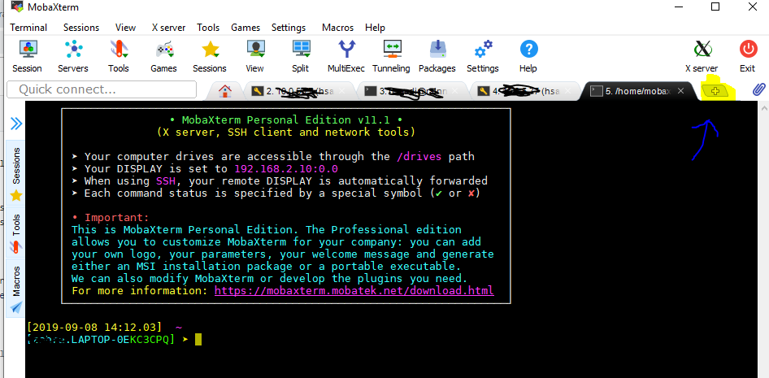

# classification_guide
This repo is for demonstrating how you can run a neural network classification using tensorflow

## How to use this repo?
First of all, you can use your own dataset or create a dummy dataset using the `dataset_gen.py` script. This script generates a dummy dataset i.e. all the images are randomly generated by uniform noise and labels are assigned randomly. 

After running the `dataset_gen.py` script, it creates a directory including the training dummy dataset.

Before starting the process, install the mobaXterm teminal on your Windows machine. It's similar to the `putty` but has a few more features. You can download it from [here](https://mobaxterm.mobatek.net/download.html).

After ssh to the linux machine by MobaXterm:

Now, you can go through the jupyter notebook file `Load_Train_Evaluate.ipynb`. For running this file, you need to follow these steps on your linux machine:

* clone this repository:
```
git clone https://github.com/hassanisaadi/classification_guide.git
```
* Enter the classification_guide directory
```
cd classification_guide
```
* run the dataset_gen.py
```
python dataset_gen.py
```
* install tensorflow
```
pip install --user tensorflow
```
* install jupyter notebook
```
pip install --user jupyter
```
* run
```
jupyter notebook --no-browser
```
* copy the link that apears.
* In mobaXterm open a windows terminal 
* run the following command in the opened terminal
```
ssh -N -L 8888:localhost:8888 <username>@<server>
```
and enter your password.
* Now on your windows machine open a browser and paste the link that you copied before. You should be able to see the jupyter notebook environment. Open the `Load_Train_Evaluate.ipynb` file and try run it step by step while you read all the comments.

